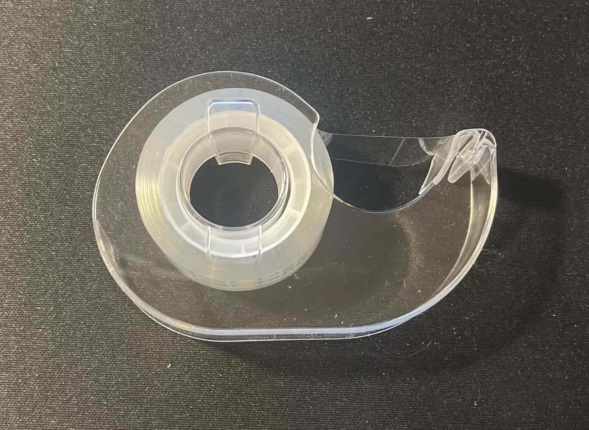
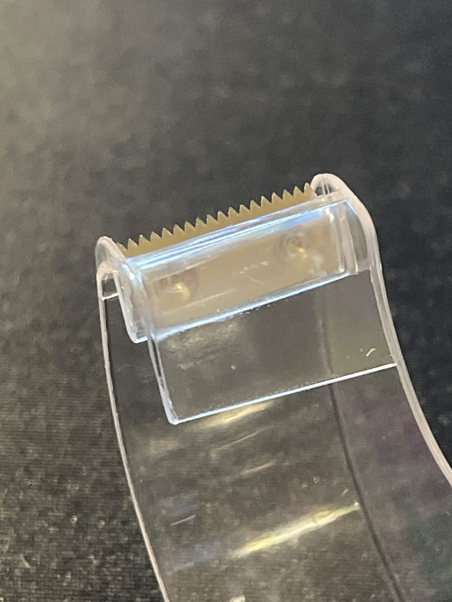
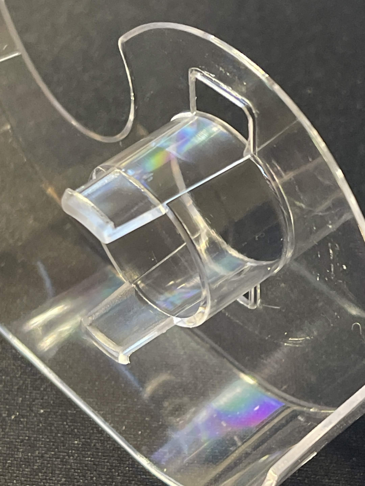
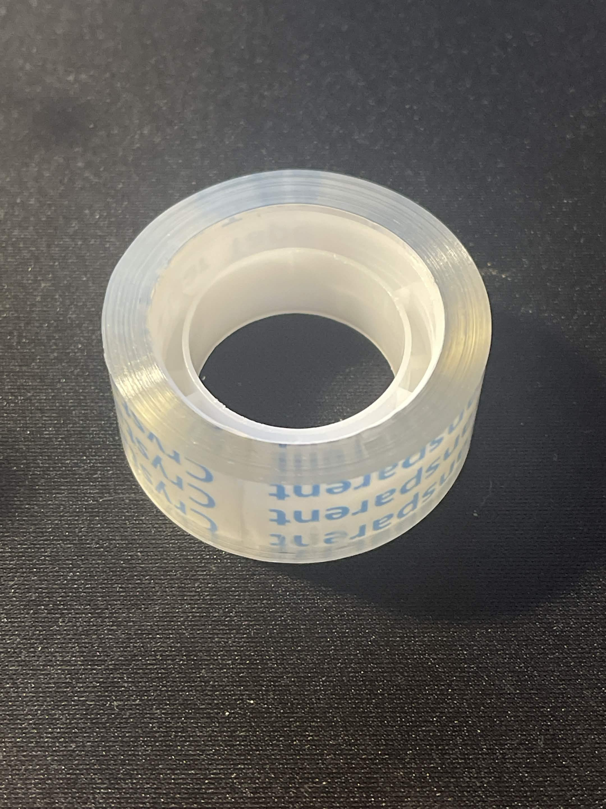

# A1 – [Topic]

## **Objective**

## **Analyze**

**Task A:**  Portfolio Analysis

For the first profile I chose to analyze, I used a random number generator to pick a student from the Spring 2026 2156 portfolio archives. The number generated was 118 which corresponded to the portfolio of Cael Brokaw.

**Navigability:**

This Portfolio is easy to navigate. All pages present had a clearly accessible link and I could go back whenever I wanted.

**Reproducibility:**

This portfolio would be very easy to reproduce as it is highly simplified and easy to understand.

**Evidence of Reasoning:**

Overall I think that the work and detail provided by this user in their assignments shows a great understanding of Mechanical Engineer reasoning, with detailed steps and thoughts throughout assignments and clearly shown math and design changes.

**Professional Tone:**

Overall this user seems to have greatly shown a professional tone in their writings throughout their portfolio though many portions did feel somewhat too brief.

[Cael Brokaw's Canvas Portfolio](https://uncc.instructure.com/eportfolios/5021/home)

For the second profile I chose to analyze, I searched for Github Portfolio pages of engineering students at NC State University. The first result was for the portfolio of Jesse Mayo.

**Navigability:**

Upon landing on this users landing page, tabs that direct readers to the key sections are readily shown and easy to understand. This portfolio shows that Greater detail can be added to organization without sacrificing simplicity or ease of access.

**Reproducibility:**

Reproducing this portfolio would likely take a greater level of skill with GitHub, and would be more reasonable for a higher level engineering student or someone with a great independent understanding of the site and how to code webpages. The work conducted likewise would take a greater level of skill in engineering, which is sensible considering their years of professional experience that go beyond what you would expect in just academics.

**Evidence of Reasoning:**

Throughout their work they showed a great level of detail, organization, and communication of their thoughts, math, design processes, etc. They clearly demonstrate a higher level of skill in engineering, likely years ahead of most MEGR 2156 students in some of their earliest works.

**Professional Tone:**

Their tone is highly professional and shows that they have a great level of experience in the academic engineering world, as well as years of experience in professional engineering.

[Jesse Mayo's Github Portfolio](https://jsmayo.github.io/)

**Task B:**  Product Analysis

**Primary Function:**

The primary function of this "Snail" style tape dispenser is to dispense and cut adhesive tape from an inserted roll. Mechanically, two tasks are performed:

>Rotational support and guidance. The cylindrical clip acts as both a bearing and a stopper to ensure the tape roll will rotate smoothly and not come out of alignment.

>Stress concentration for material failure. The serrated metal blade focuses pressure to create small failure points which then expand due to the triangular teeth.

**Governing Model:**

The main behavior involves two phases: 

Manual unrolling of the tape for length selection and the cutting with the serrated blade when force is applied downward. The governing model of the cutting phase is outlined here:

i. Model and Variables

The cutting action is governed by stress concentration and tensile failure mechanics, modeled by the tensile stress equation using a stress concentration factor at the cutting teeth:

$$\sigma_{max} = K_t \cdot \frac{F}{A}$$

* **$\sigma_{max}$**: The maximum local tensile stress experienced by the tape at the cutting edge ($\text{N/m}^2$ or $\text{Pa}$).

* **$K_t$**: The geometric stress concentration factor determined by the sharpness and shape of the blade's teeth (dimensionless).

* F: The tensile force applied by the user to the tape (N).

* A: The cross section area of the tape (A = w \cdot t, where w is tape width and t is tape thickness) (m^2).

Failure happens when sigma_{max} \ge sigma_{ut} (the maximum tensile strength of the tape).

*(Note: I am unsure how to properly display the math symbols on the published page but in the GitHub preview it displays fine.)*

Assumption:

One key assumption that makes this model valid is that the tape acts in a brittle or almost brittle manner during the quick tear. While adhesive tape is polymer based and viscoelastic, the sudden force against the sharp, rigid teeth minimizes plastic deformation and focuses the stress to cause tensile failure along the cross section.

**Component Geometry:**

Snail Style Tape Dispenser:

This tape dispenser is a modern, mass produced plastic version of a Post-Great Depression era tape dispenser, it is designed for compactness/portability, handheld use, and lower manufacturing demands than it's larger counterparts. Like many products of it's time, the substantial decrease in cost was a highly favorable factor consumers.

Serrated Blade:

This serrated blade has been imbedded permanently into the plastic shell by pressing it between two heated pieces of plastic, with indents that protrude on one side to ensure it does not slide out. When the tape is pulled over the blade and pressed down, the serrations press into and cut the tape at the desired length.

Cylindrical Clip/Holder:

The Clip/Holder presses into the hole of the tape roll, with angled end bits that are compressed upon insertion and released on the opposite side to provide a physical barrier to prevent the roll from being accidentally removed. The cylindrical shape acts as a bearing for easy, low friction rotation of the tape roll for dispensation.

Tape Roll:

This tape roll has a standardized width, thickness, strength, and inner spool diameter to ensure compatibility with the tape dispenser.

**Patent Info:**

Patent Number: USD116599S
Inventor: Jean Otis Reinecke

Potential Alternative #1:

Patent Number: US4059210A: The main function of this tape dispenser is the same, to dispense and cut adhesive tape from an inserted roll. However it is designed to be rested on a flat surface, with a weighted base for stability, not for compactness/portability, handheld use, or lower manufacturing demands.

Patent Number: USRE41505E1: The main function of this tape dispenser is the same, to dispense and cut adhesive tape from an inserted roll. However it is designed for larger tape rolls, and easy sealing of boxes for shipping/storage, not for compactness, or lower manufacturing demands.

Design Decision: One design decision I can infer from the original design is the utilization of the hole of the tape spool as an ergonomic finger holder. As a hand held tool, I think they made this design decision to improve the tactile control of the dispenser for users.

["Snail" Style Tape Dispenser Patent](https://patents.google.com/patent/USD116599S/en?oq=USD116599S)

## **Decide**

**Homepage Identity:**

To maximize clarity and eliminate confusion for it's readers, the homepage is designed to immediately state the portfolio's purpose: to document the engineering work conducted by myself for the MEGR 2156 course. Since engineering precision applies to both physical designs and communication, the landing page layout is structured to give direct, error free paths to work materials. By prefacing the scope of the course work and providing an easy to access link to the assignments tab, this homepage ensures that readers can efficiently locate and review the work without unnecessarily burdening themselves.

**One Intentional Customization:**

An intentional customization I made for my portfolio was to change the title of each assignment page to include the name of the assignment and the week it was scheduled to be completed during. This will allow readers to easily locate the assignment they wish to, as well as help to keep track of the timeframe of the semester.

**Documentation Standard:**

I will ensure that all assignments completed during this course follow the proper standard of documentation. They will Analyze, Decide, and Communicate in an effective manner so that they are easily understood by readers.

## **Communicate**

**Jacob Huss**

As an Engineer in the making, what brought me into the engineering field was my desire to understand how things worked, and how I could fix or even improve upon them. Not only that desire but also my desire to follow in my fathers footsteps and become a successful engineer. Me and him share much of the same mindset, tendencies, and inclinations that made engineering great choices for us. Like my father has done with his past works, I want my future works to have a positive impact in their application, even if it's only directly felt by the machines that I might only design one small part for, as every piece matters and should not go ignored. As engineers we should strive for improvement in both technical design and communication, in an incremental never ending loop. Nothing is perfect but everything we design should have perfection as a goal, and everything we communicate should have perfect understanding as its goal, for we are not trying our best if we are not aiming for the best. We should not neglect communication, as we can not achieve perfection on our own. We must share our knowledge to help each other improve faster, and make mistakes less often. My work will have both internal and external standards applied to it and I strive to meet both sets, for if I do not I can not say I am truly proud of it. I still have a lot to learn, both conceptually and in terms of hands-on experience, and I am looking forward to seeing what lies ahead for me as an Engineer.

Defending an engineering decision means that the logical steps, facts, and analysis' are all detailed and clear to understand, and that if they were re-attempted independently they would provide consistent and effective results again and again. I have a rough idea how to do it though I am not confident enough to go into detail. Simply put the main steps are categorized as Analysis', Decisions, and Communication.

In total I spent around 8-10 Hours on this assignment.
