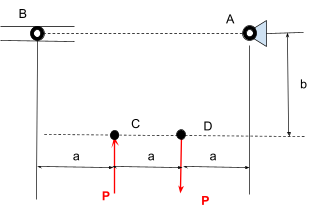
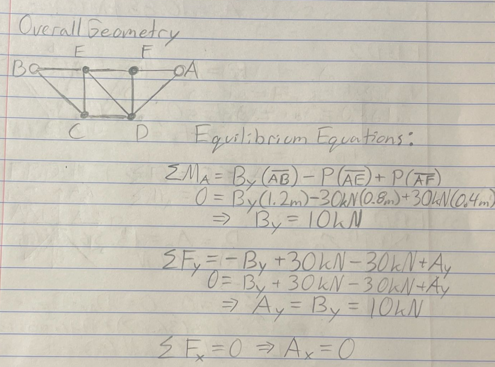
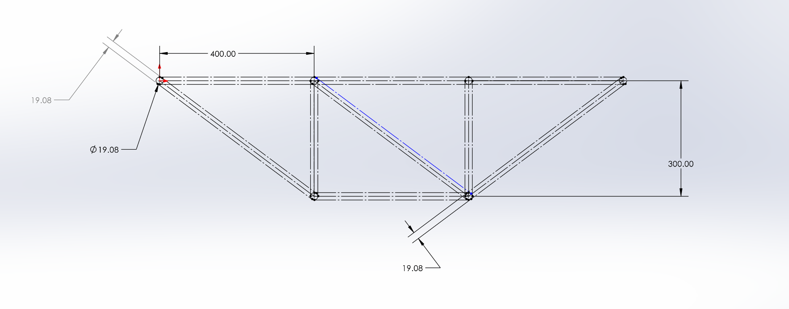
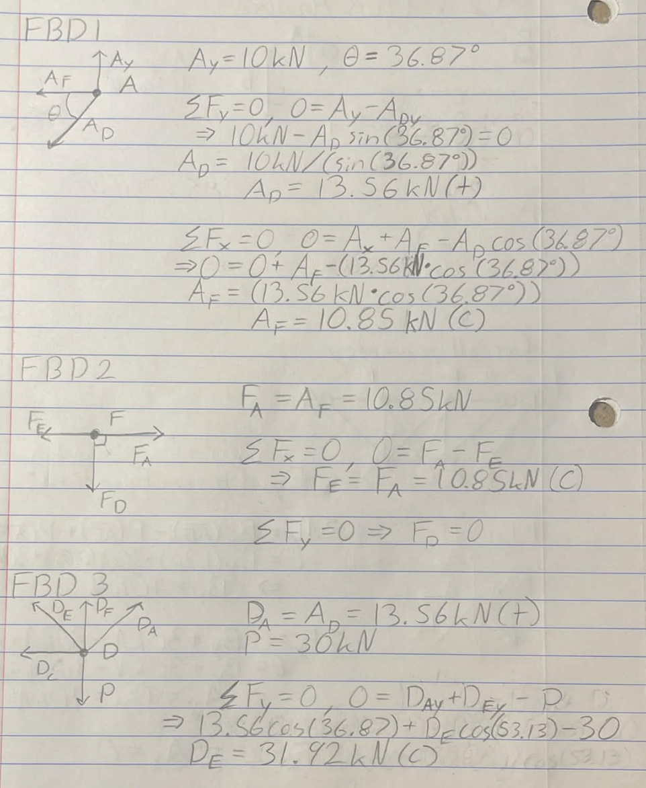
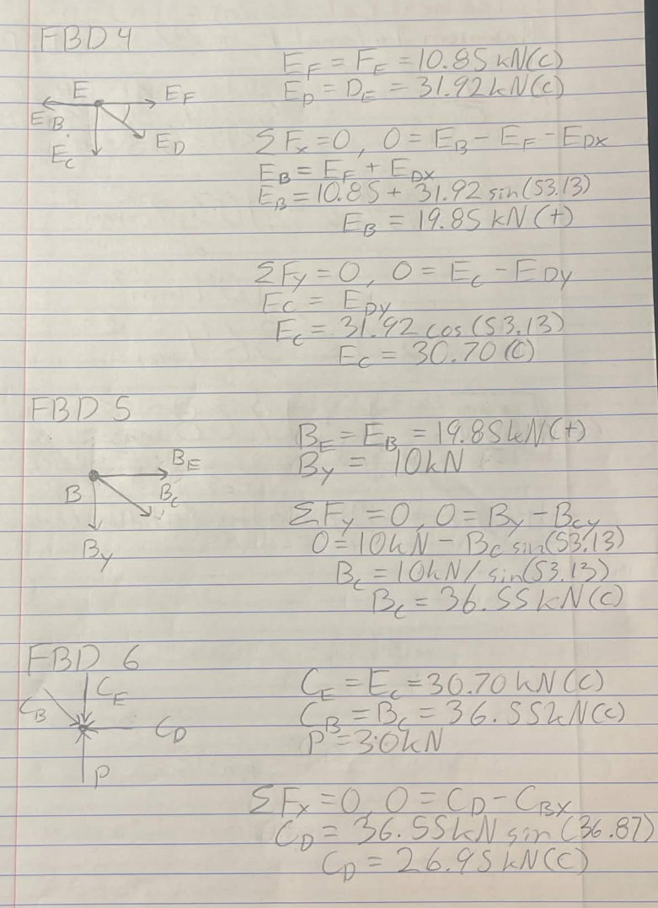
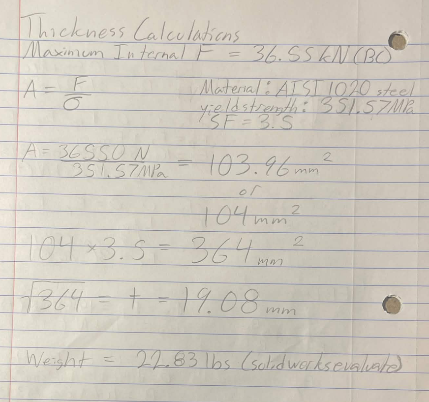
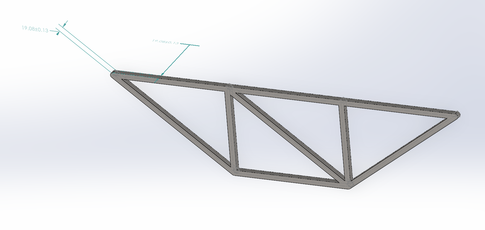
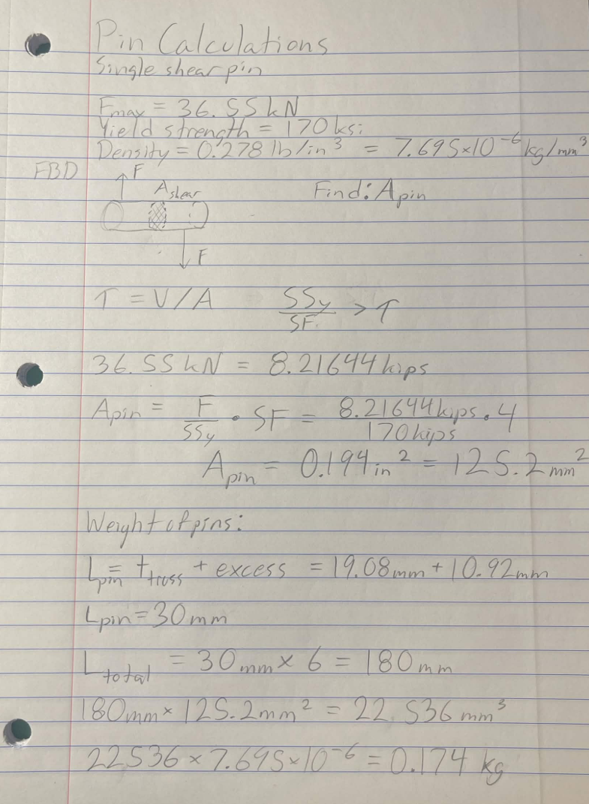
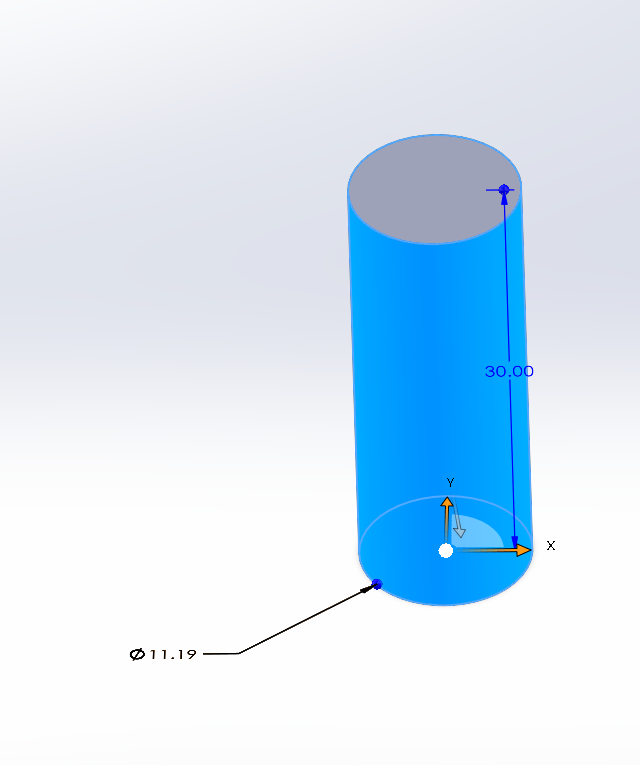

# A2 – Truss Stress Analysis

## Objective

This project focused on the design of a planar truss, combining mathematical analysis with CAD modeling to ensure structural integrity and key physical measurements.

## Analyze

Figure #1.) The force and geometric constraints of the truss design problem.
Choose a P between 20 - 30 kN. a = .4 m, b = .3 m. Point A is a pin and point B is a roller.

## Decide

To Begin this Assignment I selected a Load of 30kN, I then decided on what basic geometry I would use for the truss using what I've learned about truss design. I also wrote down the key equilibrium equations I needed for the next steps.

I found that the reaction forces at A and B were 10kN each.

With the basic geometry in mind, I began to model the truss in solid works. I ensured that the pin points were equidistant from each external edge and that the members were of uniform thickness. I had originally used a unimportant random value as a place holder for the thickness but this screenshot was taken after I was completed.

Next I drew the free body diagrams and solved for internal forces of each member.

from these calculations I found that the largest internal force was in member BC at 36.55kN

With the maximum internal force known, i could then solve for the cross sectional area of the truss. i could not find the material data sheet for A500 industrial steel so i instead opted for the 1020 steel preset on solidworks with a yield strength of 351.57MPa.

After finding the cross sectional area, i plugged in the square root value into my model on solidworks and found the approximate weight of the truss.

After completing everything for the truss i moved on to calculating the required diameter of the pins and modeling the pin in CAD. The connecting pins are made of hardened tool steel with a yield strength of 170 ksi and a density of 0.278 lb/in3.

And finally I modeled a very simple pin in CAD.

## Communicate

Lesson Learned

I still don't understand the intricacies of solid works to a great enough degree to easily model a truss with tools like Weldments but i managed to effectively model a truss without the need of any specialized tools which i think is a valuable lesson and could translate well into the real world of professional engineering. And overall I also learned a lot about the fundamentals of truss design on paper, even though my work is certainly flawed somehow.
