# A4 – Motor Mount

## Objective

For this assignment the objective is to design a motor mount for a Brushed 24V DC Gear Motor 3.6Kg*cm/46RPM w/ 99.5:1 Planetary Gearbox, using symbolic followed by numerical calculations in the design which can then be applied in 3D modeling software for a parametrically designed model.

The motor mount consists of two necessary features:

Feature 1 – The Motor Support: designed to attach to the motor face while allowing access to the motor shaft.

Feature 2 – The Wall Mount: designed to allow attachment of the motor mount to a rigid surface.

Both features are to be designed to minimize deflection and stress while satisfying the required constraints.

## Analyze

Design Requirements:

Load P = 300 N.

Motor Weight = impact assumed to be negligible.

Safter Factor SF = 3.

Maximum Deflection = 0.30 mm.

Material(Choose) = ABS, PETG, or PLA.

Motor Dimensions:

Motor Diameter = 27.7 mm.

Motor Face Mounting Holes = four M3 holes centered 11 mm away from shaft center at every 90 degrees.

Motor Length = 74.6 mm (excl. Shaft and centering lip)

Material Properties:

Selected Material = ABS

Yield Strength = 29.6 - 48 MPa, 29.6 selected for Calculations.

Youngs Modulus = 1.79 - 3.2 GPa, 1.79 selected for Calculations.

# Feature 1 – Motor Support

Given Variables

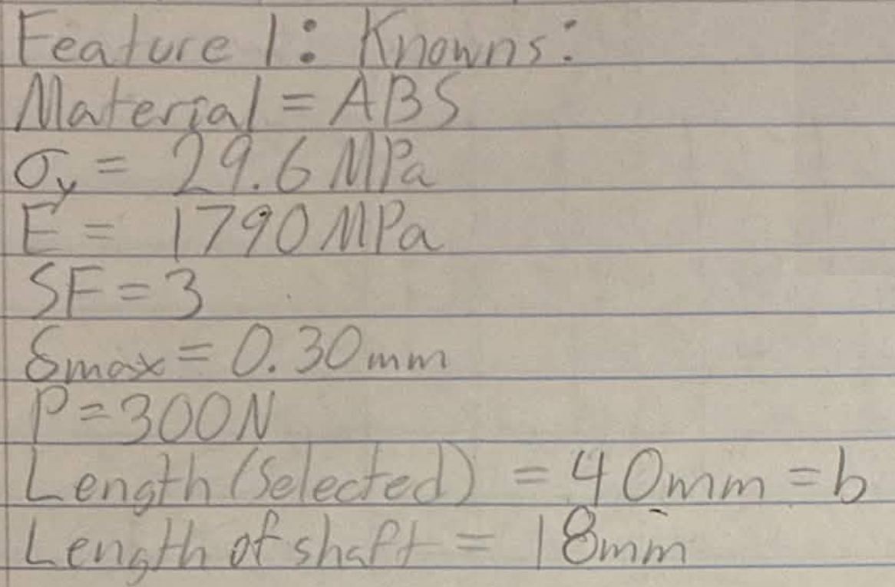

Unknown Variables

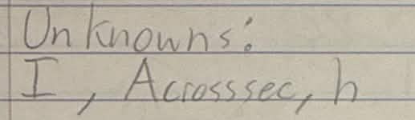

Assumptions

Free-Body Diagram / Sketch1

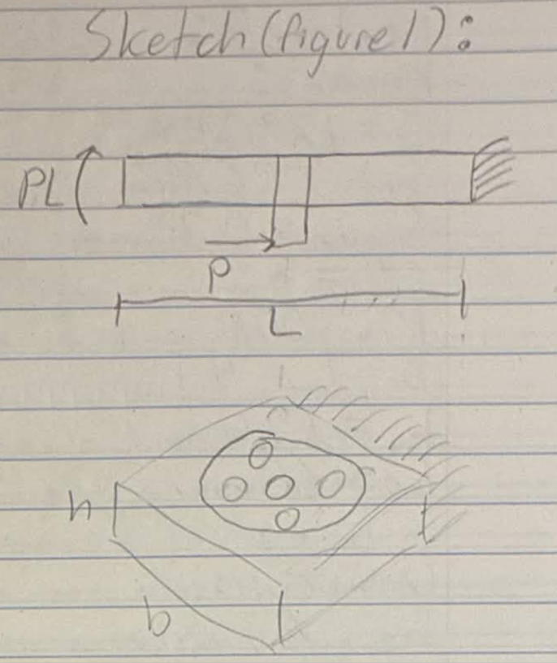

Calculations

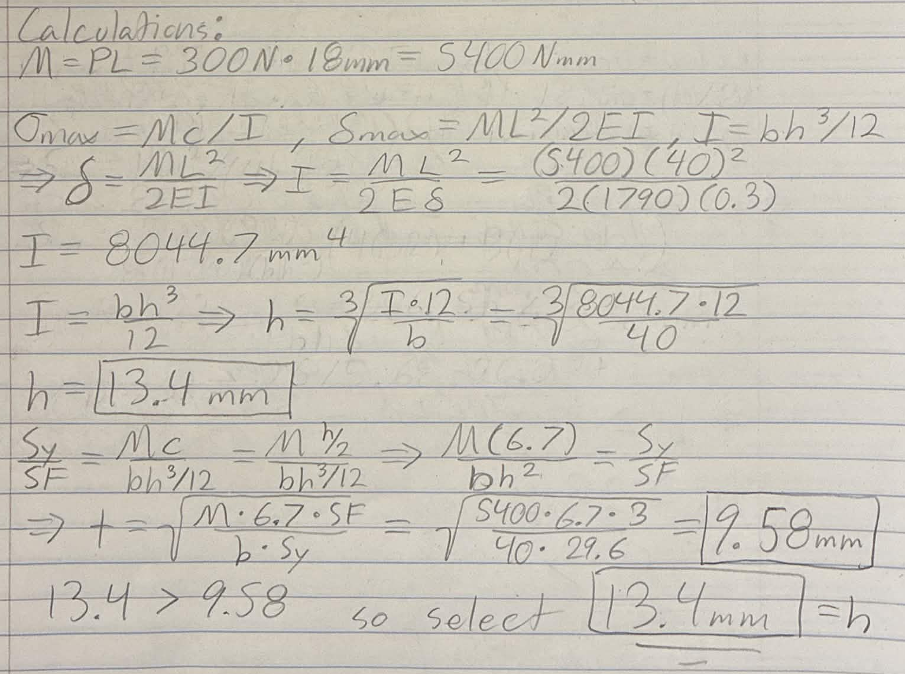

# Feature 2 – Wall Mount

Given Variables

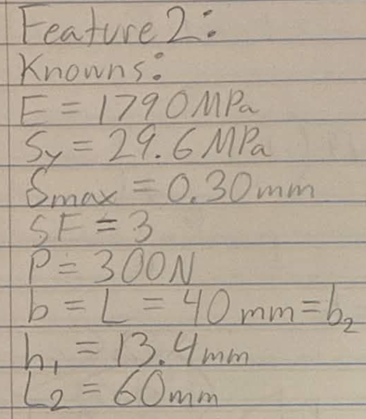

Unknown Variables

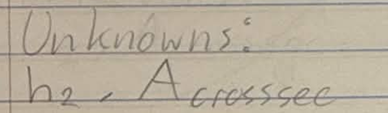

Assumptions

Free-Body Diagram / Sketch1

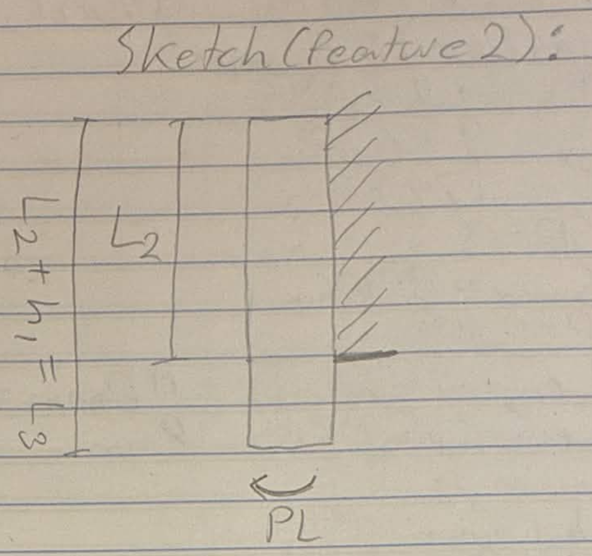

Calculations

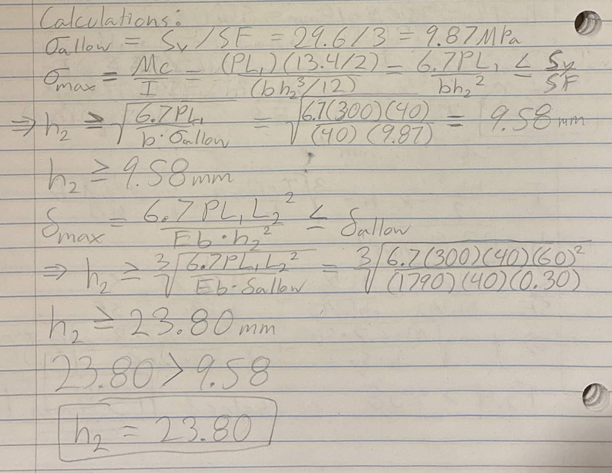

# Sketch

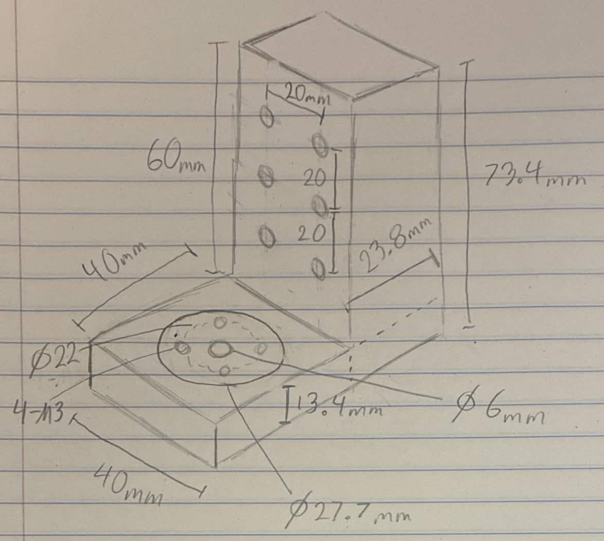

# Cad Model

After having completed the design calculations I began to design the motor mount in solid works, beginning with the parametric equations and needed variables. Once all necessary values were input, I created a sketch for Feature 1.

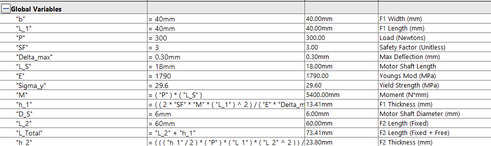

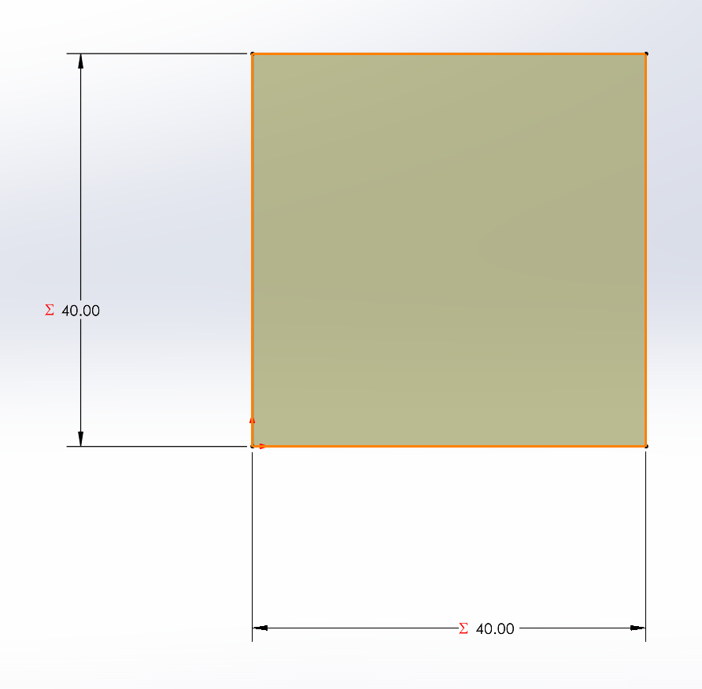

I then turned this sketch into an extruded feature and set the thickness equal to the parametric equation i set up in the equations section.

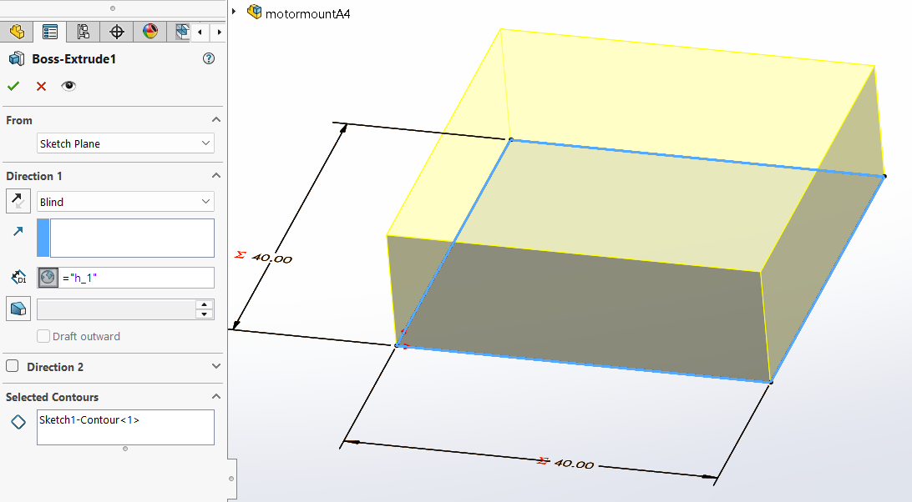

## Decide

## Communicate

