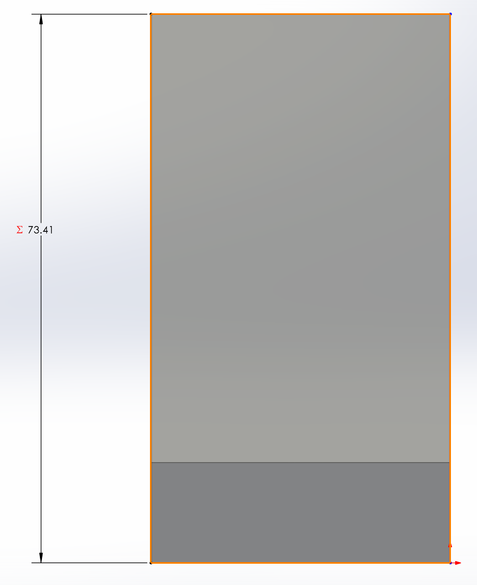
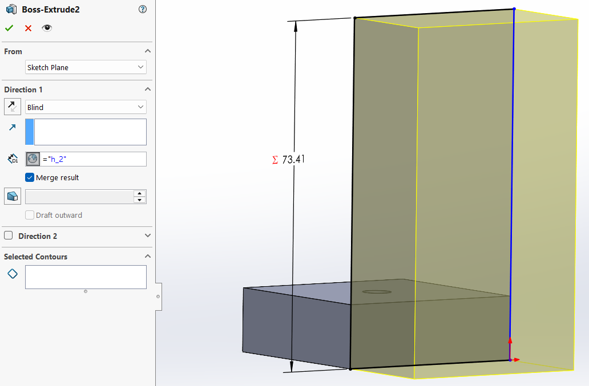
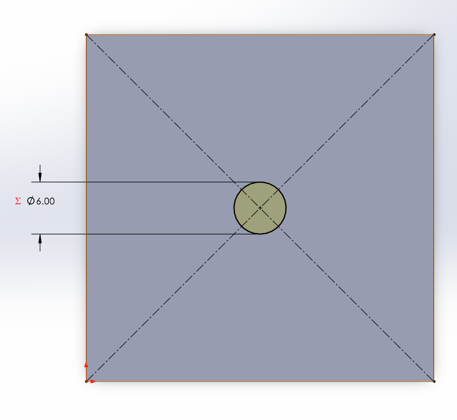
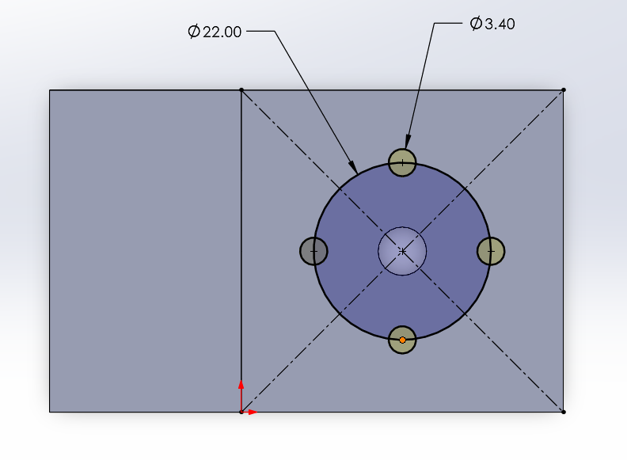
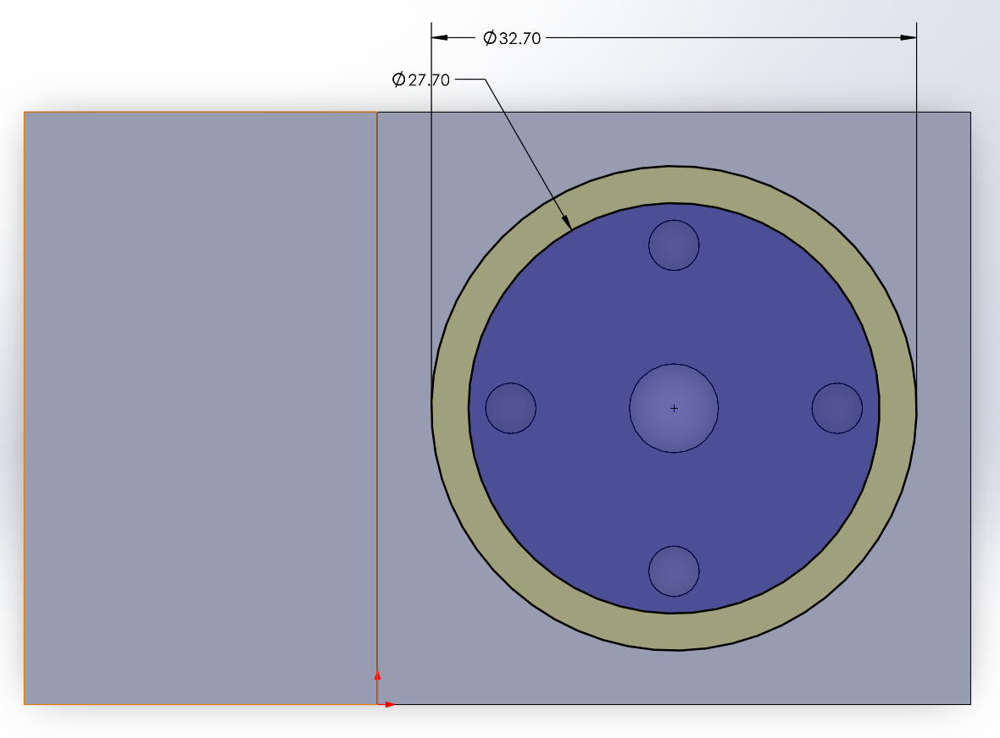
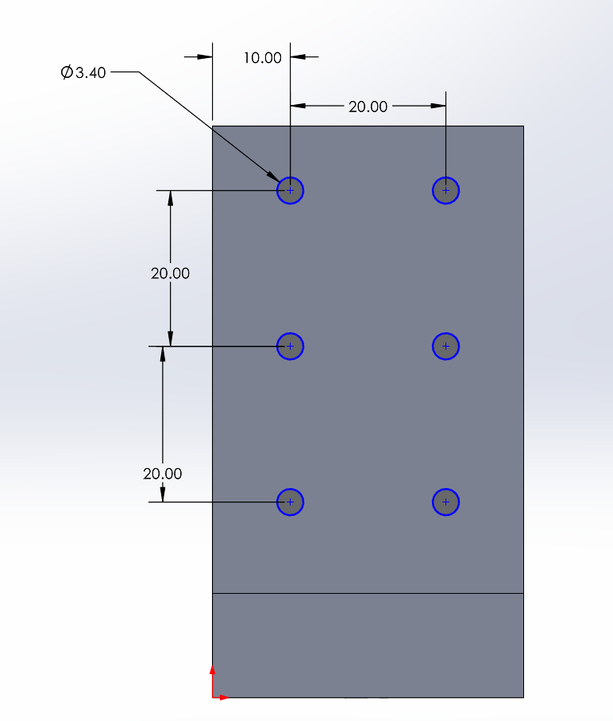
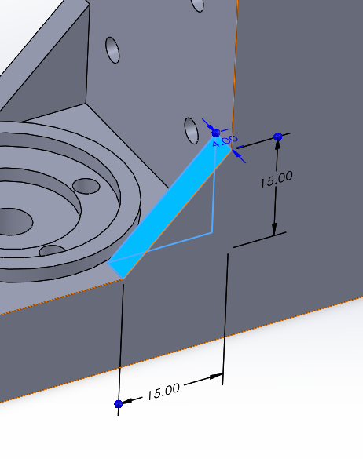
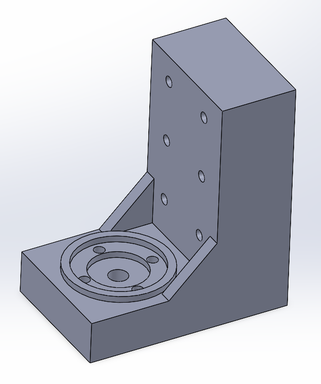

# A4 – Motor Mount

## Objective

For this assignment the objective is to design a motor mount for a Brushed 24V DC Gear Motor 3.6Kg*cm/46RPM w/ 99.5:1 Planetary Gearbox, using symbolic followed by numerical calculations in the design which can then be applied in 3D modeling software for a parametrically designed model.

The motor mount consists of two necessary features:

Feature 1 – The Motor Support: designed to attach to the motor face while allowing access to the motor shaft.

Feature 2 – The Wall Mount: designed to allow attachment of the motor mount to a rigid surface.

Both features are to be designed to minimize deflection and stress while satisfying the required constraints.

## Analyze

Design Requirements:

Load P = 300 N.

Motor Weight = impact assumed to be negligible.

Safter Factor SF = 3.

Maximum Deflection = 0.30 mm.

Material(Choose) = ABS, PETG, or PLA.

Motor Dimensions:

Motor Diameter = 27.7 mm.

Motor Face Mounting Holes = four M3 holes centered 11 mm away from shaft center at every 90 degrees.

Motor Length = 74.6 mm (excl. Shaft and centering lip)

Material Properties:

Selected Material = ABS (Selected for it's favorable heat rating, usefulness in automotive and machinery parts, toughness, and impact resistance.)

Yield Strength = 29.6 - 48 MPa, 29.6 selected for Calculations.

Youngs Modulus = 1.79 - 3.2 GPa, 1.79 selected for Calculations.

# Feature 1 – Motor Support

As specified in the assignment outline, the deflection and the derivative with respect to x of the feature attached to the wall were assumed to be zero, and the safety factor was assumed to account for the shaft and mounting holes. The goal for this section of math is to solve for the cross sectional area of the feature(in turn meaning the thickness since the width was selected).

Given Variables

These are the Variables I found from the assignment and my selections when needed.

Unknown Variables

Free-Body Diagram / Sketch1

Here is the sketch I drew for feature 1 to better understand what needed to be done. since the force was not applied to the feature itself, but rather the shaft of the motor, this slightly complicated the math. If it were an end loaded cantilever beam it would be far simpler but instead I needed to find an equation for an offset load that produces a moment.

Calculations

Through researching the topic I decided on the formulas seen below.

I ended up with the final value of 13.4 mm which allows for ~4.6 mm of shaft accessibility. If more shaft length was needed, the addition of further width for feature 1 would be the easiest fix.

# Feature 2 – Wall Mount

As specified in the assignment outline, the rigid surface was assumed to be satisfactory in it's ability to support the mounting bolts. like with feature 1, the goal for this section of math is to again solve for the cross sectional area of the feature(meaning the thickness since the width was selected).

Given Variables

These are the Variables I found from the assignment information and my selections when needed.

Unknown Variables

Free-Body Diagram / Sketch1

Calculations

Through researching the topic I decided on the formulas seen below.

I ended up with the final value of 23.8 mm. Like with feature 1 in the cases of more necessary shaft length, if feature 2 needed to be thinner for space constraints, added width would again be the easiest fix.

# Sketch

Here is my isometric sketch with dimensions that were found in the previous calculations.

# Cad Model

After having completed the design calculations I began to design the motor mount in solid works, beginning with the parametric equations and needed variables. Once all necessary values were input, I created a sketch for Feature 1 with length and width equal to their corresponding variables.

I then turned this sketch into an extruded feature and set the thickness equal to the parametric equation i set up in the equations section.

With the main dimensions of feature 1 complete i could move on to feature 2, which follows the same basic steps.

Sketch the feature with defined parametric variables.

Extrude the shape with defined parametric equation.

With The basic Geometry done I could then add additional features.

Motor Shaft Hole for necessary shaft access.

Motor Face Mounting Holes for necessary motor attachment.

Motor Outer Diameter Ridge for Further Allignment.

Wall Mounting Holes for necessary wall mounting.

Additional Rib Supports for added stability and strength.

Leaving the motor mount finally completed

<a href="./motormountA4.SLDPRT" download>Download Motor Mount Model</a>

## Decide

## Communicate

